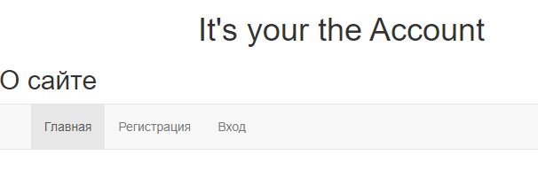
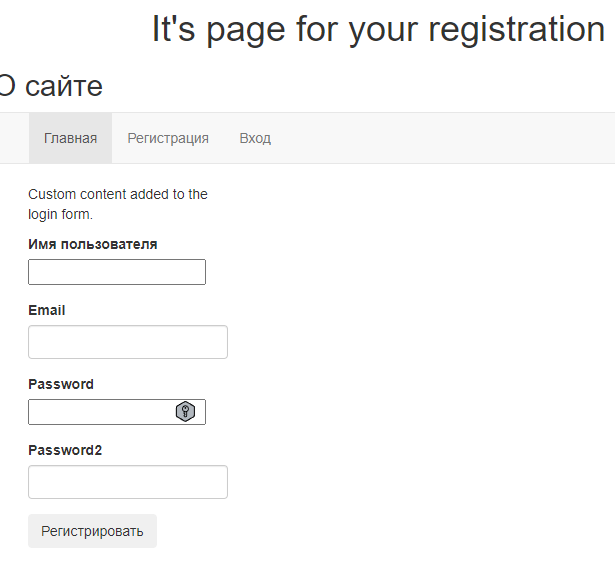
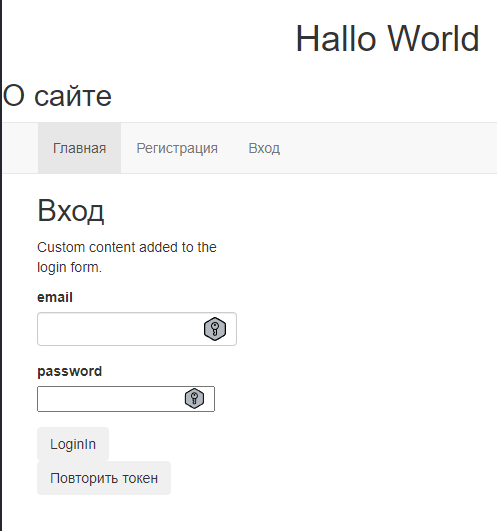
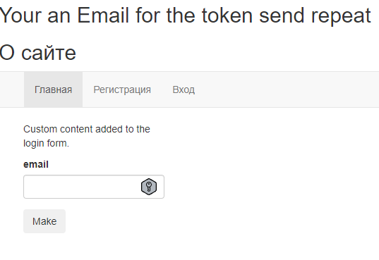
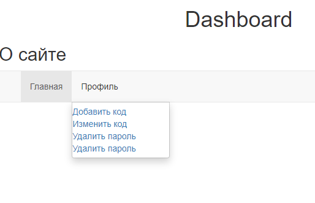
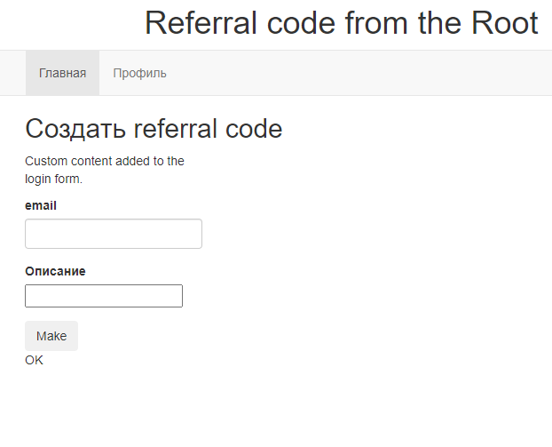
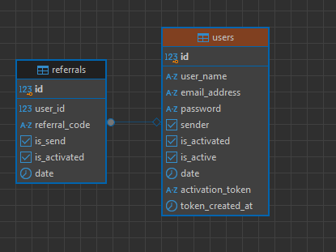

<style>
summary {
	color:#0af098;
}
</style>

# Referral module


## .ENV
Файл `.env` разместите в корне проекта 
```text
PROJECT_REFERRAL_SETTING_POSTGRES_DB=< db-name >
PROJECT_REFERRAL_SETTING_POSTGRES_USER=< user-name-from db >
PROJECT_REFERRAL_SETTING_POSTGRES_PASSWORD=<password-from-db>
PROJECT_REFERRAL_SETTING_POSTGRES_HOST=< host-of-db >
PROJECT_REFERRAL_SETTING_POSTGRES_PORT=< port-of-db >
PROJECT_REFERRAL_SECRET_KEY=< flask-secret-key >
MAIL_SERVER=smtp.mail.ru
EMAIL_PORT=25
MAIL_USE_TLS=True
MAIL_USERNAME=< email-from-admin-site >
MAIL_DEFAULT_SENDER=< your@mail.zone > 
MAIL_PASSWORD=< pasword-from-your-email >
TOKEN_TIME_MINUTE_EXPIRE=2

```
## Commands
###  Команды из backend
Базовые команды от Flask и IDE.


###  Команды из fronted
[referral_frontend](https://github.com/Tryd0g0lik/referral_frontend).\
В качестве сборщика выступает '`yarn`'. Если работаете \
с '`npm`' - удалить `'yarn.lock'` \
```text
// Установка зависимостей
`npm run install` или `npm run install package.json`


// Запустить проверки стиля для написанного кода
`run npm lint`

// Развернуть файлы (frontend) в режиме сборки
`npm run build:front`

// Для работы с проектом запустить сервер (frontend)
`npm run server:front`

```

#### build:front
Сборка файлов проводится в директорию:
- `referral\templates`;
- `referral\static` из '`referral`'

Note: Для работы с JS `[JS-файлами](src/sripts)

Файлы JS имеют динамические имена. Перед размещением новых файлов, \
предыдущие удаляются автоматически.

## Dependence
Удалите файл `pyproject.toml` если в качестве установщика используете `pip`. \
Проект собирался на установщике `Poetry`\
[requirements.txt](requirements.txt) продукт авто-сборки от `Poetry`.

## Descript
Следите зза хостом в браузере. \
Асинхронный код. \
Если сперва клонировали проект "[referral](https://github.com/Tryd0g0lik/referral)" \
в корне проекта создайте директорию "*frontend*". В нее \
клонируйте директорию "[referral_frontend](https://github.com/Tryd0g0lik/referral_frontend)'.

Зaпуск модуля открывает стартовую страницу.



*О чём этот модуль*.\
*[Регистрируясь на сайте](#регистрация), вы получаете ссылку на Email*,\
*для подтверждения. [Ссылка живет 120 сек](#токен-поступивший-на-почту)*.

*После того как подтвердили email, поподаете на страницу [для авторизации](#авторизация)*.

*Авторизовавшись, [вам доступен "Профиль"](#профиль)*.\
*Изначально страница пустая. Но после того как создадите реферальный код* \
*на странице будет опубликована ссылка (об этом ниже). *

*"Профиль" имеет подменю*. \
*Единственная рабочая (дочерняя ссылка) это "[Добавить код](#добавить-код)"*.\

*Для добавления кода, просто нажимаем на кнопку и видим ту самую ссылку о*\
*которой говорил выше. Поле лишь для заметки. Оно не обязательное*.\

*Ссылку копируем и вставляем в браузер. Пользователь с псевдо*:
- *именами*;
- *паролями*;
- *почтой*;
- *именем, попадает в базу данных*.

**Об ошибке**.
Пока вы читаете, сам шлифую код. Согласно заданию - регистрация по \
коду происходит. Но, в задаче нет авторизации (пусть и глупо звучит - \
поэтому и отправляю работу) - ошибка \
при авторизации пользователя который зарегистрирован по коду-ссылке. \
Знаю источник ошибки который мешает авторизоваться.\

Вот сейчас (пока вы читаете) и исправляю. А там после и добавлю api-запрос для \
удаления реферального кода, при условии, что он не был использован.


<details closed>
<summary >TOP-овое меню. Описание.</summary>

### Меню
Меню:

|Название| Описание                                         |
|:---|:-------------------------------------------------|
|"Главная" |страница открывается при запуске модуля.|
|"Регистрация" и "Вход" |ссылку в меню видим в не авторизованном режиме.|
|"Профиль" и подменю от "Профиль" | видим в авторизованном режиме.| 

### Регистрация
**views.py**:
- `referral/views_more/views_account.py`;
- 120 секунда для подтверждения email.
- Если не успели или не нашли на почте ссылку из ресурса, возможно использовать
кнопку "Повторить токен". Указать Email для отправки ссылки.

### Авторизация
**Первичная авторизация**:
 - Отправляем 'GET' на сервер и получаем '`csfr_token`' после \
запрашиваем '`user_token`'.
 - сохраняем его '`Cookie`'. Далее ориентируемся на \
логин '`user_token`' вместо. 
'email'. 
 

Клик по ссылке "Регистрация" видим форму для регистрации \



### Вход
**views.py**:
- `referral/views_more/views_account.py`.

Клик по ссылке "Вход" видим форму для авторизации \


#### Повторить токен
**views.py**:
- `referral/views_more/views_account.py`. \
Под формой '`Вход`' кнопка '`Посвторить токен`'. \
Кликаем и нас перебрасывает на страницу '`/repeat_token`' с \
формой для повторной отправки токена на '`Email`'. \


### Токен поступивший на почту
Сейчас лучше скопировать ссылку и самим вставить в адресную сроку браузера.\
Пользователя перекидывает на страницу с формой для авторизации.
#### Успешное подтверждение email-адреса
- 120 секунд после регистрации - время жизни токена который поступает на email.
- Не успели за 120 секунд - [повторите токен](#повторить-токен).

### Профиль
- cсылку видно в меню после авторизации;
- наводим курсор на профиль и появляется подменю.\


#### Добавить код
При клике видим форму для создания реферального кода.\


Note: В данный момент не рабочая.

### Пароль для авторизации
В DB сохраняется в хешированом виде. \
Хешировать Email или нет надо уточнять.

### DB
**models.py**:
- `referral/models_more/model_init.py`;
- `referral/models_more/model_users.py`;
- `referral/models_more/model_referral.py`.

#### DB '`Users``' имеет следующее

|Название| Описание                                         |
|:---|:-------------------------------------------------|
|'`firstname`' |имя пользователя|
|'`email`' |email пользователя. Он должен быть уникальный. Часть логики backend ориентируется на него|
|'`password`'|пароль|
|'`send`' |по умолчанию '`False`'. '`True`' - сообщения для аутентификации отправлено на почту|
|'`is_activated`' |По умолчанию '`False`'. '`True`' - клик по ссылке прошел в течении 120 секунд. Как итог пользователь перебрасывается на страницу [для авторизации](#вход). Успешное событие , из db удаляет время ('`token_created_at`') создания токена. Сам токен остается. Часть логики на него ориентируется|
|'`is_active`' |По умолчанию '`False`'. '`True`' - сообщения для аутентификации  отправлено на почту|
|'`date`' |время регистрации пользователя|
|'`activation_token`' |токен|
|'`token_created_at`' |время создания токена. Первые 120 секунд токен сохраняет рабочее состояние|

#### DB '`Referrals``' имеет следующее
|Название| Описание                                         |
|:---|:-------------------------------------------------|
|'`user_id`'| index пользователя из db '`Users`'               |
|'`referral_code`'| реферальный код                                  |
|'`is_send`' | по умолчанию '`False`'. '`True`' - сообщения для отправлено на почту (по назначению не используется в работе)|
|'`is_activated`' | по умолчанию '`False`'. '`True`' - код активный  | 
|'`date`'| время создания токена                            |



#### Models files 
Файлы с описанием моделей db разделены на 2 части:

|Основная|Дополнительная|
|:----|:----|
|'`referral/models.py`'|'`referrals/models_more/models_*.py`'|
|||


|Основная| Дополнительная                           |
|:----|:-----------------------------------------|
|'`referrals/models_more/model_init.py`'| Родительская модель. от нее наследуемся. |
|'`referrals/models_more/model_referral.py`'| Сохраняем реферальный код.               |
|'`referrals/models_more/model_users.py`'| Сохраняем пользователей.                 |
|||

```python
# referrals/models_more/model_referral.py

class Referrals(Base):
    """
    This is a model Referral of table in db.
    This a table for saving of referral code.
    """

    __tablename__ = "referrals"

    id = sq.Column(sq.Integer, primary_key=True)
    user_id = sq.Column(
        sq.Integer, sq.ForeignKey("users.id"), unique=True, nullable=False
    )
    description = sq.Column("description", sq.String(150))

    referral_code = sq.Column(
        "referral_code", sq.String(150), nullable=True, unique=True
    )
    is_send = sq.Column("is_send", sq.Boolean(), default=False)
    is_activated = sq.Column("is_activated", sq.Boolean(), default=False)
    date = sq.Column(sq.DateTime, default=datetime.utcnow)

    email = relationship("Users", backref="referral")

    def __init__(self, user: object, **kw: Any):
        super().__init__(**kw)
        self.user_id = user.id
        self.referral_code = e.generate_dumps_token_len(user.email, 12)

    def __str__(self):
        return f"User email: {self.email} Description: "
```

</details>

<details closed>
<summary>Дополнительно</summary>

###  Forms 

Напрямую работают с html-шаблонами и файлами '`views*.py`'.\


| Основная              | Дополнительная                                                               |
|:----------------------|:-----------------------------------------------------------------------------|
| '`referral/forms/form_login.py`' | Для авторизации.                                                             |
| '`referral/forms/form_referral.py`' | Для создания реферального кода. Указываем описание. Поле не обязательное.    |
| '`referral/forms/form_registration.py`' | Для регистрации.                                                             |
| '`referral/forms/form_token_second.py`' | Для повторной отправки токена на почту при авторизации. Токен живет 120 сек. |
|||

```python
# referral/forms/form_referral.py
class GetFormReferralCode(FlaskForm):
    """
    This is a form under dashbord of profile's page.
    It's "Создать referral code".
    :param 'email': str. User's email is addressee.
    :param 'description' This a description into the range of 0 to 150 symbol.
    It's a marker for a referral-code.
    """

    description = StringField(
        "Описание",
        validators=[
            validators.length(
                max=150,
                message="Max. (количество для описания ссылки) 150 символов.",
            ),
        ],
    )
    submit = SubmitField("Make", render_kw={"class": "btn btn-secondary"})

    def validator_register_email(self, email: [dict, object]):
        """
        This is a email's validator.
        :param email: [dict, object]. 'main = {"data": "your@mail.ru"}'
        Min. Length is 7 symbols.
        :return: str if is all Ok and False if what wrong.
        """
        strBool = validate_emails(email)
        return strBool

# referral/forms/validators.py
def validate_emails(email) -> [str, bool]:
    """
    This is a email's validator.
    :param email: str. Min. Length is 7 symbols.
    :return: str if is all Ok and False if what wrong.
    """
    if len(email.data) < 7:
        raise ValidationError("We're sorry! Your email has less than the 7 symbols.")
    try:
        emailinfo = validate_email(email.data, check_deliverability=False)
        email = emailinfo.normalized
        return email
    except EmailNotValidError as err:
        print(f"This is an email not a valid: {str(err)}")
        return False
```
#### views files 
Файлы с описанием моделей db разделены на 2 части:

| Основная              | Дополнительная                      |
|:----------------------|:------------------------------------|
| '`referral/views.py`' | '`referrals/views_more/views_*.py`' |
|||


| Основная              | Дополнительная                                      |
|:----------------------|:----------------------------------------------------|
| '`referrals/views_more/views_account.py`' | Страницы авторизации, регистрации, отправка токена. |
| '`referrals/views_more/views_profile.py`' | Страница профиля.                                   |
| '`referrals/views_more/views_referral.py`' | Страница с формой добавления реыерального кода.     |
| '`referrals/views_more/views_service.py`' | Получаем '`CSRF`' + '`API`'.                        |
|||


### Валидация
Поля формы имеют базовую валидацию и дополнительную на \
стороне '`views-файлов`'. \
Например: \
```text
# Check a field empty
if not password:
    return render_template(
        "users/register.html",
        form=form,
        message="Password cannot be empty.",
    
    )

if password != password2:
    return render_template(
        "users/register.html",
        form=form,
        message="Passwords do not match.",
    )
```

</details>


## Отсутствует
Проект не имеет:
- модель не имеет функции "Выход", а значит данные пользователя \
остаются в обработке. Надо это учитывать при желании авторизоваться со стороны \
иного пользователя;
- Кеширование не везде (например на email нет);
-  swagger.
- тестов нет - нет задачи.

Нк и на последок.
Даже если вы авторизовались, попадая на главную страницу всё равно придется \
повторно ввести логин/пароль. Ну, млм ручками набрать url  внутренней страницы.


## JS из репо referral_frontend/frontend 
JS файлы имеют динамические имена. Удобно для отслеживания версий. \
Размещаются в дереве на этапе сборки '`webpack`' из \
[referral_frontend](https://github.com/Tryd0g0lik/referral_frontend).

## Вопросы

> "*Возможность получения реферального кода по email ...*"

Тут полно вопросов для уточнения. Но, если взять пользователя, то в качестве \
ответа на эту задачу реализована ссылка. Та [ссылка которая подтверждает](#токен-поступивший-на-почту) email.

> "*Получение информации о рефералах по id ...*"

А, кто должен информацию получать если у пользователя может быть только ОДНА ссылка.\
Затем, получение какой информации? \
Ну, а если сам пользователь , то у него может быть активен только один код. 


Сопоставляя некоторые подзадачи друг с другом, кажется, что под "реферальным кодом"\
разное понимание. Но уточнять нет возможности.

## Ну и в конце. 
Благодарю за интересное задание. До работы с задачей , с Flask-ом не работал. \
Теперь могу выполнять задания.\
Раньше всё Djanпo и самописное. 


